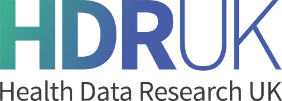
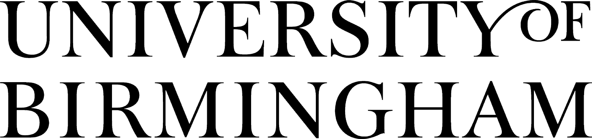

## Purpose

The **National Academy for Health Data Science** is a new initiative that seeks to become a nationally accessible training hub in advanced health data science.

It is currently being developed by Professors [Iain Styles](https://www.cs.bham.ac.uk/~ibs/) ([University of Birmingham](http://www.birmingham.ac.uk)) and [Christopher Yau](https://www.bdi.ox.ac.uk/Team/christoper-yau) ([Health Data Research UK](http://www.hdruk.ac.uk)/[University of Oxford](http://www.ox.ac.uk)) with initial set-up funding from [Health Data Research UK](http://www.hdruk.ac.uk).

## Why are you doing this?

Access to advanced Health Data Science training in the UK is patchy.

There are elements of excellence, such as Centres for Doctoral Training, but access to this type of training is often restricted to a limited number of individuals. While there are an increasing variety of training programmes offered by academic institutions and commercial organisations, awareness of these training opportunities can be limited, potentially costly and quality assurance maybe lacking. Delivery models may also be unsuitable for certain groups of potential learners (e..g. individuals with caring responsibilities, returning to work, etc).

Training in certain entry-level topics is highly duplicated (e.g. Introduction to Deep Learning) whilst there is little or no training available in other critical specialist subjects (e.g. Healthcare Requirements Engineering). The lack of scale means financial viability is difficult to achieve for training in certain specialisms or topic areas. 

Furthermore, for those who are thinking about entering health data science from another discipline, where do you start if you already have considerable expertise and experience in relevant areas? Does someone with a PhD in Theoretical Physics, who can already do highly advanced mathematics, need to go back to do a Masters degree in Health Data Science? Can a potential employer afford to invest in the time and cost for someone like this to *“learn on the job”*?

The development of the Academy is a response to these issues. We want to start connecting the dots of excellence across the UK and support the development of future health data scientists by helping navigate the complex training needs required and to build flexible solutions that address areas of unmet training need.

## What will we not do?

The Academy will not support entry-level and introductory training and education in data science. This includes but not exclusively:

-	Mathematical foundations (e.g. linear algebra, numerical analysis),
-	Computer science foundations (e.g. principles of algorithms),
-	Learning programming languages and tools (e.g. how to code in Python),
-	Highly specialised training in subject-specific topics (e.g. bioinformatics analysis using PLINK).
	
The Academy will signpost to the many providers (e.g. university-run courses, Coursera) and will not seek to replicate the many pre-existing training offerings in this domain.

## Who are we looking for?

We expect Academy participants will be someone who has:

1.	Graduate-level experience and capability in core areas of mathematics,
2.	Experience of developing software for scientific research purposes,
3.	The ability to learn new programming languages with relatively little direct guidance.

Participants should also be open-minded and show humility in their approach to learning as they may be introduced to novel concepts or alternate paradigms that conflict with their existing knowledge and practice.

If you are looking to do one or more of the following then you may benefit from the Academy:

1. Seeking to change scientific disciplines (to health data science),
2. Maintain knowledge during a career interruption,
3. Updating knowledge after returning to work from a career interruption,
4. Update or acquire new knowledge while in employment,
5. Seeking to employ workers who require training in health data science.

## What will we do?

The Academy will focus on supporting the following activities:

-	the development of new advanced training courses that fill gaps and unmet needs in health data science (especially imparting tacit knowledge or "know-how") 
-	the delivery of training courses that enable cross-disciplinary transitions for scientists with advanced quantitative skills and provide flexible modes of learning,
-	create and curate accredited learning pathways and curricula to help newcomers to navigate the complex training offerings,
-	providing a specialist forum for employers (academic and commercial) to showcase their research and development activities and attract potential employees.

## Further information

The Academy is currently in development and we are looking to bring in collaborative partners from across the UK to make this a truly national initiative. For further information about how to become involved, contact us: <phd@hdruk.ac.uk>

You can follow these links to learn more about the Academy:

- [Academic Board](academic_board.md)
- [Course Registration](course_registration.md)
- [Learning Pathways](pathways.md)
- [Frequently Asked Questions](faq.md)

## Current Partners

&nbsp;&nbsp;&nbsp;&nbsp;

